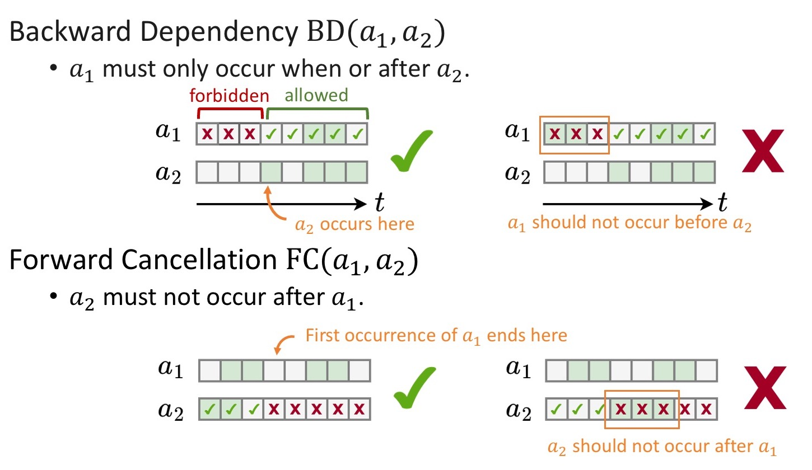
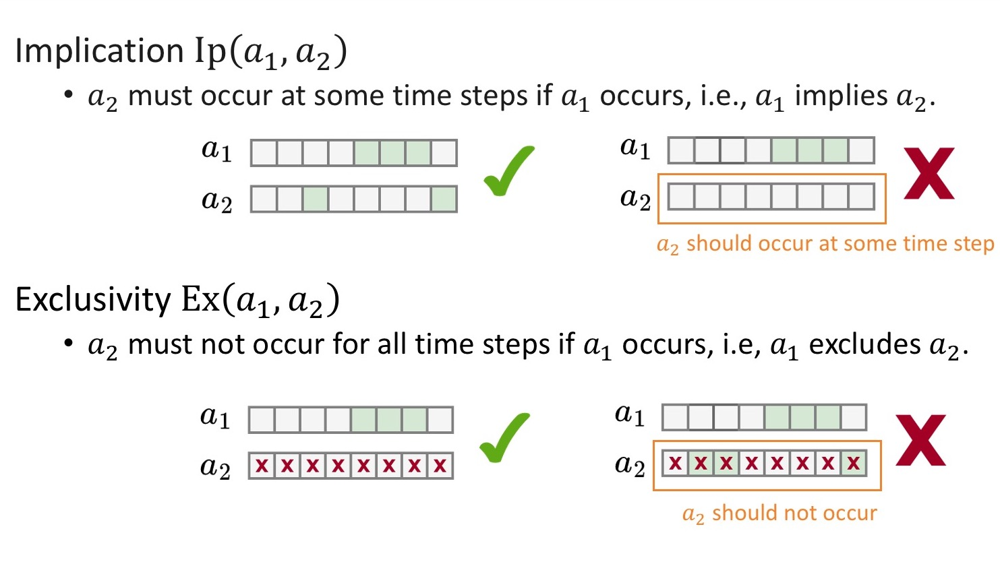
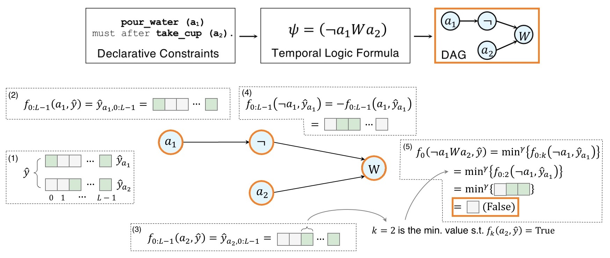

<video autoplay preload controls object-fit="cover" width="100%" height="100%">
  <source src="assets/videos/animation.mp4" type="video/mp4">
</video>

 

<h1>Table of Contents</h1>

- [1. Abstract](#1-abstract)
- [2. How does it work?](#2-how-does-it-work)
  - [2.1. Problem Formulation](#21-problem-formulation)
  - [2.2. Define and Collect Constraints](#22-define-and-collect-constraints)
  - [2.3. Write Temporal Logic Formula](#23-write-temporal-logic-formula)
  - [2.4. Evaluate `$\psi$` using `$\hVec{y}$`](#24-evaluate-psi-using-hvecy)
  - [2.5. Let the Model Learn from `$\Set{C}$`](#25-let-the-model-learn-from-setc)
- [3. References](#3-references)

# 1. Abstract
{: .text-center}

We propose Differentiable Temporal Logic (DTL), a model-agnostic framework that introduces temporal constraints to deep networks.
DTL treats the outputs of a network as a truth assignment of a temporal logic formula, and computes a temporal logic loss reflecting the consistency between the output and the constraints.
We propose a comprehensive set of constraints, which are implicit in data annotations, and incorporate them with deep networks via DTL.
We evaluate the effectiveness of DTL on the temporal action segmentation task and observe improved performance and reduced logical errors in the output of different task models.
Furthermore, we provide an extensive analysis to visualize the desirable effects of DTL.

# 2. How does it work?
{: .text-center}

## 2.1. Problem Formulation

We consider the action segmentation task in a video clip with `$L$` frames and `$N$` candidate actions `$\Set{A}={a_1,\ldots,a_N}$`.
We assume that there is a deep task model $g$ parameterized by `$\Mat{\Theta}$`, which takes frames `$\Vec{x}_0, \ldots, \Vec{x}_{L-1}$` as input, and outputs `$\hVec{y}_{a_1}, \ldots, \hVec{y}_{a_N}$`, where `$\hVec{y}_{a_i} \in \mathbb{R}^L$` is the unnormalized score for the presence of action `$a_i$` throughout the `$L$` frames.
We assume `$\hVec{y}_{a_i,t} > 0$` indicates $a_i$ presents at time `$t$`, and `$\hVec{y}_{a_i,t} \leq 0$` indicates the opposite.

Apart from the ground truth label `$\Vec{y}_{a_1},\ldots,\Vec{y}_{a_N}$`, there is a set of constraints `$\Set{C}$` that describe the relation between actions.
The design goal of DTL is to incorporate these constraints into the task model `$g$`, so that `$\hVec{y}$` complies with both the ground truth `$\Vec{y}$` and the constraints.
In order to do so, we introduce a temporal logic representation `$\Psi$`, and an evaluator $f$ that enforces the constraints in formula `$\psi \in \Psi$` on `$g$`, through its outputs `$\hVec{y}$`.

We achieve this objective in the following steps:

1. Collect constraints as `$\mathcal{C}$`.
2. Write constraints as a temporal logic formula `$\psi$`.
3. Evaluate `$\psi$` against model output `$\hVec{y}$` using `$f$`, as `$f(\psi, \hVec{y})$`, which reflect if `$\psi$` is satisfied.
4. Optimize model `$g$` such that `$f(\psi, \hVec{y})$` shows `$\hVec{y}$` satisfies `$\psi$`.

[🔝TOP](#top) &emsp; [🔝TOC](#toc)
{: .text-center}

## 2.2. Define and Collect Constraints

We define four types of constraints: **backward dependency (BD)**, **forward cancellation (FC)**, **implication (Ip)**, and **exclusivity (Ex)**, between two actions `$a_1$` and `$a_2$`.
Their semantics are illustracted as below:

<figure class="cfig" style="width:70%">
  
  <figcaption class="cfigcap">Semantics for Backward Dependency and Forward Cancellation.</figcaption>
</figure>

<figure class="cfig" style="width:70%">
  
  <figcaption class="cfigcap">Semantics for Implication and Exclusivity</figcaption>
</figure>

We can collect constraints directly from dataset annotations.
For example, we can iterate over all possible actions pairs `$\langle a_i,a_j \rangle, a_i, a_j \in \Set{A}$`.
If `$a_i$` never occurs before `$a_j$`, then we know there is a constraint `BD($a_i$,$a_j$)`.
If `$a_i$` never occurs after `$a_j$`, then we know there is a constraint `FC($a_j$,$a_i$)`.

[🔝TOP](#top) &emsp; [🔝TOC](#toc)
{: .text-center}

## 2.3. Write Temporal Logic Formula

A [Linear Temporal Logic (LTL)](https://en.wikipedia.org/wiki/Linear_temporal_logic) (Pnueli 1977) formula `$\psi$` is recursively defined as:

`$$\psi := \underbrace{\tlaction{True} \ |\  \tlaction{False} \ |\  a }_{\text{Constants and Atom}} \ |\  \underbrace{\tlnot \psi_1 \ |\  (\psi_1 \tland \psi_2) \ |\  (\psi_1 \tlor \psi_2)}_{\text{Logical Connectives}} \ |\  \underbrace{\tlnext \psi_1 \ |\  \tleventual \psi_1 \ |\  (\psi_1 \tlwkuntil  \psi_2) \ |\  (\psi_1 \tlsince \psi_2)}_{\text{Temporal Modal Operators}},$$`
where `$\psi_1$` and `$\psi_2$` are also LTL formulas.

In the appendix of the [paper](assets/docs/dtl_neurips2022.pdf) we provide detailed discussion on the semantics of these operators.
Briefly:

- `$\tlnext \psi_1$`: `$\psi_1$` must be satisfied in the next time step.
- `$\tleventual \psi_1$`: `$\psi_1$` must be satisfied eventually.
- `$(\psi_1 \tlwkuntil \psi_2)$`: `$\psi_1$` must be always satisfied before `$\psi_2$` is satisfied. If `$\psi_2$` is never satisfied, `$\psi_1$` must remain satisfied forever.
- `$(\psi_1 \tlsince \psi_2)$`: `$\psi_1$` must be satisfied after `$\psi_2$` is satisfied. If `$\psi_2$` is never satisfied, `$\psi_1$` is not constrained.

Using these operators, we can write constraints as:

- `BD($a_i$,$a_j$): $(\tleventual a_i \tland \tleventual a_j) \rightarrow (\tlnot a_i \tlwkuntil a_j).$`
- `FC($a_i$,$a_j$): $(\tleventual a_i \tland \tleventual a_j) \rightarrow (\tlnot a_j \tlsince a_i).$`
- `Ip($a_i$,$a_j$): $\tleventual a_i \rightarrow \tleventual a_j.$`
- `Ex($a_i$,$a_j$): $\tleventual a_i \rightarrow \tlnot \tleventual a_j.$`

We can also use `$\tland$` to build a conjunction of all the constraints.
This becomes the final formula `$\psi = \textsf{BD}(a_i,a_j) \tland \textsf{FC}(a_k, a_l) \tland \ldots.$`

[🔝TOP](#top) &emsp; [🔝TOC](#toc)
{: .text-center}

## 2.4. Evaluate `$\psi$` using `$\hVec{y}$`

After constraints are written as formula `$\psi$`, the final task is to evaluate `$\psi$` using `$\hVec{y}$`.
We define the evaluation function `$f$` as 
`$$f_t(\psi, \hVec{y}) = f(\psi, \hVec{y}_{a_1:a_N, t:L-1}) : \Psi \times \underbrace{\mathbb{R}^{L-t} \times \cdots \times \mathbb{R}^{L-t}}_{N\ \text{times}} \rightarrow \mathbb{R},$$`
where `$f_t(\psi, \hVec{y})$` evaluates `$\psi$` using `$\hVec{y}$` starting from time `$t$`.

We want `$f$` to have the following three properties:

1. **Sound**. In other words, there is a determined relation between `$f_t(\psi, \hVec{y})$` and the satisfaction of `$\psi$`.
2. **Differentiable**. `$f$` should be differentiable w.r.t `$\hVec{y}$` so that we can use it to train our task model.
3. **Extendable**. We want `$f$` to handle any `$\psi$`, not just the one created from the four constraints, so that it can potentially work for constraints in other tasks.

Inspired by the Signal Temporal Logic (Fainekos and Pappas 2009), we define the evaluator for all possible `$\psi$` forms as follows:

`$$f_t (\tlaction{True}, \hVec{y}) = +\infty, \quad f_t (\tlaction{False}, \hVec{y}) = -\infty, \quad f_t (a, \hVec{y}) = \hVec{y}_{a,t},$$`
`$$f_t (\tlnot \psi_1, \hVec{y}) = -f_t (\psi_1, \hVec{y}),$$`
`$$f_t (\psi_1 \tland \psi_2, \hVec{y}) = \text{min}^\gamma \big\{ f_t (\psi_1, \hVec{y}), f_t (\psi_2, \hVec{y}) \big\},$$`
`$$f_t (\psi_1 \tlor \psi_2, \hVec{y}) = \text{max}^\gamma \big\{ f_t(\psi_1, \hVec{y}), f_t (\psi_2, \hVec{y}) \big\},$$`
`$$f_t (\tlnext \psi_1, \hVec{y}) = f_{t+1} (\psi_1, \hVec{y}),$$`
`$$f_t (\tleventual \psi_1, \hVec{y}) = \text{max}^\gamma \big \{ f_{t:L-1}(\psi_1, \hVec{y}) \big\},$$`
`$$f_t (\psi_1 \tlwkuntil \psi_2, \hVec{y}) = \text{min}^\gamma \{ f_{t:k} (\psi_1, \hVec{y}) \}, \text{where} \ k\geq t\ \text{is the min. integer s.t. } {\small f_k(\psi_2, \hVec{y}) > 0},$$`
`$$f_t (\psi_1 \tlsince \psi_2, \hVec{y}) = \text{min}^\gamma \{ f_{k:L-1} (\psi_1, \hVec{y}) \}, \text{where} \ k\geq t\ \text{is the min. integer s.t. } {\small f_k(\psi_2, \hVec{y}) > 0}.$$`

All the operations above are **differentiable**, with `$\min^\gamma\{x_{1:L-1}\} = - \frac{1}{\gamma} \ln \sum_{i=1}^{L-1} e^{-\gamma x_i}$` and `$\max^\gamma\{x_{1:L-1}\} = -\min^\gamma\{ -x_{1:L-1} \}$`.
It is also **extendable** as `$f$` has been defined for any possible LTL formula.
We also provided a sketchy proof in the [paper](/assets/docs/dtl_neurips2022.pdf) that `$f$` is **sound**: 
`$$\psi \in \Psi, \gamma \rightarrow \infty: f_t(\psi, \hVec{y}) > 0 \Leftrightarrow \hVec{y} \text{ satisfies } \psi.$$`

Following this definition, evaluation becomes propagation of logits in a DAG converted from `$\psi$`:

<figure class="cfig" style="width:70%">
  
  <figcaption class="cfigcap">Evaluation of an example formula using logits from two actions. 
  The constraint is first written as formula $\psi = (\neg a_1 \tlwkuntil a_2)$, then represented as a DAG.
  (1) - (5) show how $f_0(\neg a_1 \tlwkuntil a_2, \hVec{y})$ is computed.
  (1) shows the output $\hVec{y}$ of task model, where green boxes indicate positive values (\tlaction{True}) and grey boxes indicate negative values (\tlaction{False}).
  (2) and (3) show the evaluation of leaf nodes $a_1$ and $a_2$, which is the start of evaluation.
  (4) takes the evaluation results for $a_1$ from (2) and evaluate $\neg a_1$.
  In (5), the $\tlwkuntil$ node uses the result for $\neg a_1$ from (4) and $a_2$ from (3) to perform the evaluation for $(\neg a_1 \tlwkuntil a_2)$.
  </figcaption>
</figure>

[🔝TOP](#top) &emsp; [🔝TOC](#toc)
{: .text-center}

## 2.5. Let the Model Learn from `$\Set{C}$`

We can finally incorporate constraints into our training.
Recall that our goal is to enforce the output `$\hVec{y}$` to be consistent with both ground truth and constraints `$\Set{C}$`.
In order to do so, we need to minimize (1) a task loss `$\mathcal{L}_\textsf{T}$` which is defined by task and the dataset annotation, and (2) a temporal logic loss `$\mathcal{L}_\textsf{TL}$`, which encourages positive formula evaluation results.
To put them together:

`$$\mathcal{L} = \mathcal{L}_\textsf{T}(\hVec{y}, \Vec{y}) + \lambda \mathcal{L}_\textsf{TL}(\hVec{y}, \Set{C}),$$`
where `$\mathcal{L}_\textsf{TL}(\hVec{y}, \Set{C}) = \log(1+\exp(-f_t(\psi, \hVec{y}))$` penalizes negative evaluation results.

[🔝TOP](#top) &emsp; [🔝TOC](#toc)
{: .text-center}

# 3. References

- Amir Pnueli. The temporal logic of programs. In *FOCS*, pages 46–57, 1977.
- Georgios E. Fainekos and George J. Pappas. Robustness of temporal logic specifications for continuous-time signals. *Theor. Comput. Sci.*, 410(42):4262–4291, 2009.